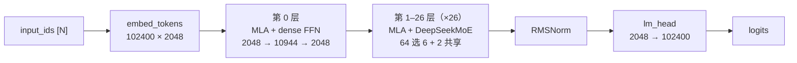
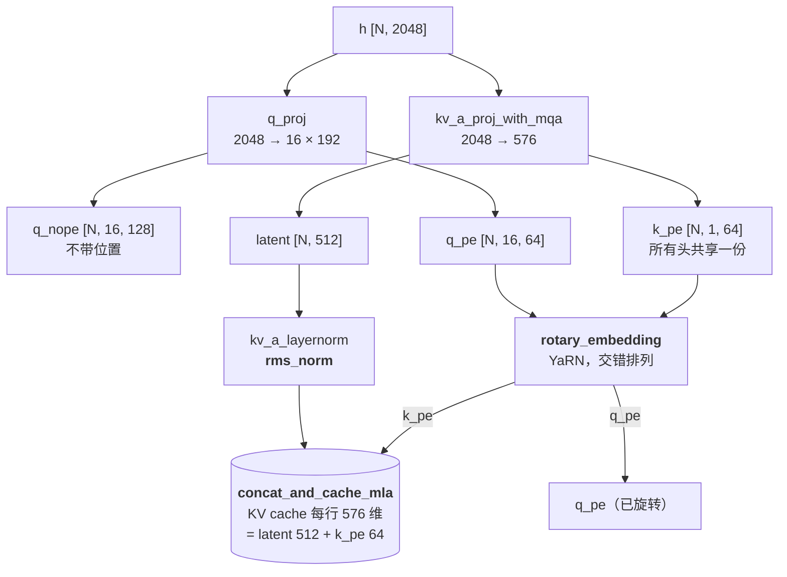
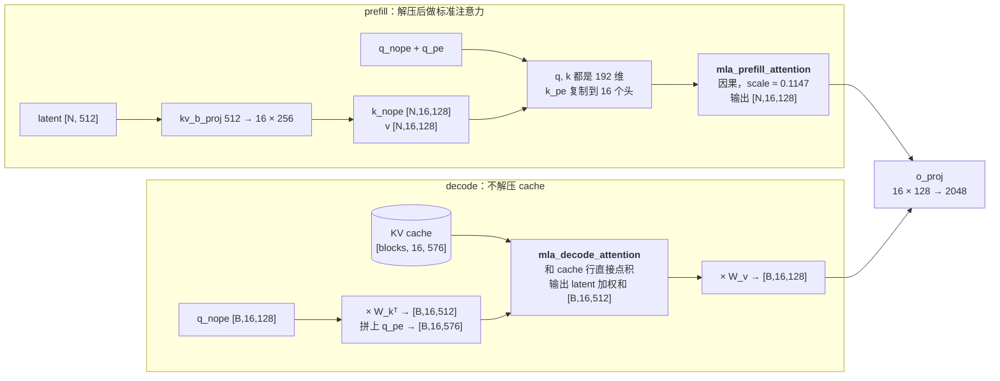
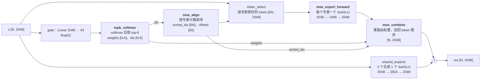

# Llm_infer

从零实现 **DeepSeek-V2-Lite** 推理：C++ 写算子，Python 整合成模型和推理引擎，用来研究 MLA（Multi-head Latent Attention）和 DeepSeekMoE。

- 算子通过 `TORCH_LIBRARY` 注册为 `torch.ops.llm_infer.*`，直接吃 torch 张量，没有拷贝。
- 每个 C++ 算子都有一份纯 PyTorch 参考实现（`llm_infer/ref_ops.py`），用于单测对照和缺内核时回退。
- 整个模型和 transformers 原生 `DeepseekV2ForCausalLM` 逐 logits 对齐（prefill、分页 decode、贪心生成）。

## DeepSeek-V2-Lite 结构速览

### 官方架构图


<sub>图源：[deepseek-ai/DeepSeek-V2](https://github.com/deepseek-ai/DeepSeek-V2)（MIT），论文 [arXiv:2405.04434](https://arxiv.org/abs/2405.04434)。
图中带斜线的圆圈是推理时缓存的内容：latent c<sup>KV</sup> 和 k<sup>R</sup>。
注意：图里 Q 也先压缩到 latent c<sup>Q</sup>，那是完整版 V2 的做法；**V2-Lite 没有这一步**（`q_lora_rank=None`），直接 `q_proj` 出 q。</sub>

### 关键参数

| 项目 | 数值 |
|---|---|
| 总参数 / 激活参数 | 15.7B / 2.4B |
| 层数 | 27（第 0 层普通 FFN，1–26 层 MoE） |
| hidden / 头数 | 2048 / 16 |
| MLA | `kv_lora_rank=512`，`q_lora_rank=None`，QK = 128 (nope) + 64 (rope)，V = 128 |
| MoE | 64 路由专家选 6 + 2 共享专家，专家中间层 1408，softmax + greedy top-k，不重新归一化 |
| RoPE | YaRN，factor 40，注意力 scale = mscale² / √192 ≈ 0.1147 |
| KV cache | 每 token 每层 576 维（512 latent + 64 k_pe），bf16 下每 token 共 30.4 KB |

### 整体结构



每一层都是 pre-norm 残差结构：


代码里把「+ 残差」和下一个 RMSNorm 合并成一个算子 `fused_add_rms_norm`，少读写一遍内存。

### MLA（一层注意力）

图中**加粗**的是本项目的 C++ 算子。

**① 投影、RoPE、写 cache**：prefill 和 decode 都一样



**② 注意力**：prefill 和 decode 走不同路径



decode 为什么可以不解压？`kv_b_proj` 的权重按行切成 W_k（前 128 行）和 W_v（后 128 行），利用两条恒等式
（`tests/test_ops.py::test_latent_decode_equals_decompressed_attention` 验证）：

```
q_nope · (W_k c) = (W_kᵀ q_nope) · c          # 注意力分数：query 投影到 latent 空间，直接和 cache 点积
Σ aₜ (W_v cₜ)    = W_v (Σ aₜ cₜ)               # value：先在 latent 空间加权求和，最后乘一次 W_v
```

### KV cache 有多省

按 V2-Lite 的头维度（K 192、V 128），每个 token 每层需要缓存的元素数：

| 方案 | 每 token 每层 | 相对 MHA |
|---|---:|---|
| MHA（16 头 × (192 + 128)） | 5120 | `████████████████████` 100% |
| GQA 4 组（假设同样头维度） | 1280 | `█████` 25% |
| **MLA（V2-Lite 实际）** | **576** | `██▎` 11.3% |
| MQA 1 组（假设同样头维度） | 320 | `█▎` 6.3% |

MLA 缓存量接近 MQA，但每个头仍然有自己的 k_nope 和 v（从 latent 解压得到），表达能力接近 MHA。

### 分页 KV cache 的组织

```
kv_cache[layer] : [num_blocks, block_size=16, 576]
                                               └─ 每行 = [ latent 512 | k_pe 64 ]

seq A（37 个 token）block_table = [5, 2, 9]
  block 5 : token  0–15
  block 2 : token 16–31
  block 9 : token 32–36（剩 11 个空位留给后续 decode）

slot = block_id × 16 + offset      # concat_and_cache_mla 按 slot 写入
                                   # mla_decode_attention 按 block_table 读出
```

### DeepSeekMoE（一层 FFN）



`moe_align` 的作用：把 N 个 token × 6 个选择按专家编号排好，每个专家的 token 挨在一起，
这样 `moe_expert_forward` 每个专家只做一次矩阵乘，而不是逐 token 计算。例如 N=3、top-2、4 个专家：

```
topk_ids  = [[2, 0],   [1, 2],   [0, 3]]       # 扁平下标 0..5
sorted_idx = [1, 4,  2,  0, 3,  5]              # 专家 0: 扁平位置 1,4；专家 1: 2；专家 2: 0,3；专家 3: 5
offsets    = [0, 2, 3, 5, 6]
token 号   = sorted_idx // 2 = [0, 2, 1, 0, 1, 2]
```

## 算子列表

| 算子 | 用途 | CPU C++ | CUDA |
|---|---|:-:|:-:|
| `rms_norm` | 各处 RMSNorm | ✅ | ⬜ |
| `fused_add_rms_norm` | 残差相加 + RMSNorm 融合 | ✅ | ⬜ |
| `silu_and_mul` | SwiGLU 激活 | ✅ | ⬜ |
| `rotary_embedding` | YaRN RoPE（交错 / neox 两种排列） | ✅ | ⬜ |
| `concat_and_cache_mla` | 写分页 latent KV cache | ✅ | ⬜ |
| `mla_prefill_attention` | 变长因果注意力，QK/V 维度不同 | ✅ | ⬜ |
| `mla_decode_attention` | 在压缩 cache 上的分页 decode 注意力 | ✅ | ⬜ |
| `topk_softmax` | MoE 路由 | ✅ | ⬜ |
| `moe_align` | 按专家计数排序 | ✅ | ⬜ |
| `moe_expert_forward` | 分组 SwiGLU 专家计算 | ✅ | ⬜ |
| `moe_combine` | 加权合并回 token 顺序 | ✅ | ⬜ |

Embedding、Linear、lm_head 直接用 torch（BLAS / cuBLAS）。
CUDA 列还没写：在 GPU 上目前所有算子自动回退到 `ref_ops`，模型可以直接跑，再一个个替换成 CUDA 内核。

CPU 内核只支持 float32 / float64（CPU 上 bf16 没有原生算术类型），其他 dtype 自动回退。

## 目录

```
csrc/
  ops.h                  算子声明和语义说明
  torch_bindings.cpp     schema 定义（TORCH_LIBRARY）
  cpu/norm_act.cpp       rms_norm / fused_add_rms_norm / silu_and_mul
  cpu/mla.cpp            rotary / cache 写入 / prefill & decode 注意力
  cpu/moe.cpp            topk_softmax / moe_align / expert_forward / combine
  cuda/                  （待写）放 .cu 文件，setup.py 会自动编译
llm_infer/
  ops.py                 分发层：C++ 内核 or 参考实现
  ref_ops.py             纯 PyTorch 参考实现
  config.py              配置（兼容 Hub config.json 和 transformers 格式）
  rope.py                YaRN cos/sin 表、注意力 scale
  model.py               MLA / MoE / 解码层 / 整个模型
  engine.py              分页 KV cache + prefill/decode + 采样
  loader.py              safetensors 加载（专家权重直接拷入堆叠张量）
tests/
  test_ops.py            每个 C++ 算子 vs 参考实现
  test_model_vs_hf.py    小号随机模型 vs transformers，含 Hub 格式加载
scripts/
  setup_vast.sh          vast.ai 一键环境 + 下载模型 + 对比
  compare_hf.py          真实权重下和 transformers 对比
examples/generate.py     命令行生成
```

## 本地（Mac / Linux CPU）

```bash
uv venv --python 3.12 .venv && source .venv/bin/activate
uv pip install torch transformers safetensors pytest ninja setuptools
pip install -e . --no-build-isolation      # 或 python setup.py build_ext --inplace
pytest -q tests                            # 29 个测试
```

后端切换：`LLM_INFER_BACKEND=auto|cpp|torch`，或代码里 `llm_infer.ops.set_backend(...)`。

## GPU（vast.ai，RTX PRO 6000 Blackwell 96GB）

镜像选 `pytorch/pytorch:*-cuda12.8-cudnn9-devel` 或更新的 devel 版，磁盘 ≥150GB。

```bash
git clone git@github.com:clveryang/Llm_infer.git && cd Llm_infer
bash scripts/setup_vast.sh
python examples/generate.py --model-dir checkpoints/DeepSeek-V2-Lite-Chat --prompt "介绍一下 MLA"
```

Blackwell 注意：torch 需要支持 `sm_120`（CUDA ≥ 12.8、驱动 ≥ 570），编译扩展时设置 `TORCH_CUDA_ARCH_LIST=12.0`。

## 下一步：写 CUDA 内核

1. 在 `csrc/cuda/xxx.cu` 实现，末尾 `TORCH_LIBRARY_IMPL(llm_infer, CUDA, m) { m.impl("xxx", &xxx); }`
2. `pip install -e . --no-build-isolation` 重新编译
3. `pytest tests/test_ops.py -k xxx`：测试会自动加入 cuda 设备，和参考实现对比
4. `python scripts/compare_hf.py` 确认整模型没问题，再比较吞吐

建议顺序：`rms_norm` / `silu_and_mul`（入门）→ `rotary_embedding` / `concat_and_cache_mla` → `topk_softmax` / `moe_align` → `mla_decode_attention`（分页 + latent，重点）→ `mla_prefill_attention` → `moe_expert_forward`（grouped GEMM）。
