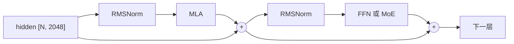

# DeepSeek-V2-Lite 模型结构详解

从 embedding 到 logits，把一次前向经过的每个部件捋一遍。这里只讲结构，
MLA 具体怎么算（prefill / decode 两条路径、KV cache 布局）见[项目 README](../README.md)。

参数数字可以自己跑出来：`python scripts/param_budget.py`

## 参数花在哪

| 部件 | 总参数 | 每个 token 激活 |
|---|---:|---:|
| embed_tokens | 0.21B | 0（只是查表） |
| **MLA × 27 层** | 0.37B | 0.37B |
| 第 0 层 dense FFN | 0.07B | 0.07B |
| **MoE × 26 层** | **14.85B** | 1.80B |
| lm_head | 0.21B | 0.21B |
| **合计** | **15.71B** | **2.45B** |

两个关键事实：

- **94% 的参数在 MoE 里**，但每个 token 只用上其中 12%。所谓 15.7B 总参数、2.4B 激活就是这么来的。
- **注意力只占 2.4% 的参数**，可它决定了 KV cache 大小和长文本的速度。参数少不等于不重要。

## 一、embed_tokens：查表

```
input_ids [7]  →  hidden [7, 2048]
```

一张 `102400 × 2048` 的表，每个 token id 取对应那一行。没有计算，就是内存读取。
出来的 `[7, 2048]` 就是接下来 27 层反复加工的东西。

V2-Lite 的 `tie_word_embeddings=False`，所以**输入的 embedding 表和最后的 lm_head 是两套独立权重**，各 0.21B。

## 二、核心概念：残差流

理解 Transformer 结构最重要的一句话：

> **`hidden` 是一条从头贯穿到尾的「主干道」，每一层不是替换它，而是往上面加东西。**

```
hidden = embedding
hidden = hidden + 注意力层算出来的增量
hidden = hidden + FFN 算出来的增量
...                                共 27 层，54 次累加
hidden → 最后归一化 → lm_head → logits
```

所以任何一层「坏掉」（输出全 0），模型也不会崩，只是少了一份贡献；梯度也能沿着这条主干道直通到底，
这是深层网络能训起来的关键。代码里这条主干道就是 `DecoderLayer.forward`（`llm_infer/model.py`）里的 `residual` 变量。

## 三、一层的骨架（27 层都一样）



这叫 **pre-norm**：归一化放在子层**前面**，主干道上不做归一化。
早期 Transformer 是 post-norm（归一化在残差相加之后），深层时训练不稳定，现在基本都改成 pre-norm。

代码里把「+ 残差」和「下一层的 RMSNorm」合并成一个算子 `fused_add_rms_norm`，
因为它们紧挨着，合起来能少读写一遍 2048 维数据。

## 四、RMSNorm

### 形状规则

```
输入 [..., D]  →  输出 [..., D]       形状完全不变
权重 [D]                              只有最后一维这么长
```

前面有多少维、每维多大都无所谓，**只有最后一维 D 参与归一化**：

| 输入 | 权重 | 输出 |
|---|---|---|
| `[7, 2048]` | `[2048]` | `[7, 2048]` |
| `[2, 7, 2048]` | `[2048]` | `[2, 7, 2048]` |
| `[5, 512]` | `[512]` | `[5, 512]` |

### 逐行独立

RMSNorm 是**逐行独立**的运算，把张量看成 `n` 行、每行 `D` 个数：

```
对每一行 x[0..D-1]：
    rms = sqrt( (x₀² + x₁² + … + x²_{D-1}) / D + ε )
    输出[j] = x[j] / rms × weight[j]
```

每行自己算自己的，行与行之间没有任何交互（把第 0 行乘 100，其他行的输出一个字节都不变）。
归一化后每行的均方根变成 1，再乘可学习的 `weight` 做逐维缩放。

这也是为什么前面的维度可以任意：`[2, 7, 2048]` 和 `[14, 2048]` 对 RMSNorm 是同一件事。
C++ 内核就是这么处理的（`csrc/cpu/norm_act.cpp`）：

```cpp
const int64_t d = input.size(-1);        // 最后一维
const int64_t n = input.numel() / d;     // 前面所有维乘起来，拉平成 n 行
```

本项目把 token 拉平成一维，所以传进去的都是二维 `[N, D]`（N = 这批的 token 总数）；
HuggingFace 那种写法是三维 `[batch, seq, D]`，行为完全一样。

### 和 LayerNorm 的区别

| | LayerNorm | RMSNorm |
|---|---|---|
| 输入输出形状 | `[..., D]` → `[..., D]` | 一样 |
| 参数 | `weight [D]` + `bias [D]` | 只有 `weight [D]`，**没有 bias** |
| 计算 | 先减均值，再除标准差 | **不减均值**，直接除均方根 |

少了减均值这一步就少一遍求和，效果实测差不多，所以现在的大模型基本都用 RMSNorm。
它的作用是把向量的「长度」拉到固定尺度、只保留方向信息，让后面的矩阵乘输入稳定。

### 模型里出现在哪

V2-Lite 一次前向要做 **82 次** RMSNorm：

| 位置 | 维度 | 个数 |
|---|---:|---:|
| `input_layernorm`（注意力前） | 2048 | 27 |
| `post_attention_layernorm`（FFN/MoE 前） | 2048 | 27 |
| **`kv_a_layernorm`（MLA 内部，作用在压缩后的 latent 上）** | **512** | 27 |
| `model.norm`（lm_head 前） | 2048 | 1 |
| 合计 | | **82**，参数 0.126M |

注意 `kv_a_layernorm` 的维度是 **512 不是 2048**，它归一化的是压缩后的 latent，很多人第一次读代码会忽略。
完整版 V2 还多一个 `q_a_layernorm`（1536 维），V2-Lite 没有。

参数加起来只有 0.126M（占全模型的 0.0008%），但少了它训练会炸。

### 精度：半精度也在 float32 里算

无论权重是 bf16 还是 fp16，求平方和这一步都会先升到 float32，写回时再转成原 dtype。
`x²` 求和很容易在半精度下溢出或丢精度，这跟官方实现一致：

```python
xf = x.float()
xf = xf * torch.rsqrt(xf.pow(2).mean(-1, keepdim=True) + eps)
return weight * xf.to(dtype)     # llm_infer/ref_ops.py
```

CUDA 内核也是同样策略：`c10::Half` / `c10::BFloat16` 读出来立刻转 float，算完再转回去。

### 为什么要和残差相加融合

RMSNorm 是**访存密集型**的：读 `N×D` 个数、写 `N×D` 个数，中间只有几次乘加。
算力再强也没用，瓶颈在内存/显存带宽。

而在 pre-norm 结构里，「残差相加」后面紧跟着就是下一次 RMSNorm，所以合成一个算子 `fused_add_rms_norm`：

```
不融合：读 x、读 res → 写 res      再读 res → 写 x      （4 趟 N×D 访存）
融合后：读 x、读 res → 写 res、写 x                     （3 趟，且 res 还在缓存里）
```

`scripts/bench.py` 实测这个融合算子比 PyTorch 版快约 1.25 倍，快的部分基本全来自省下的访存。

## 五、MLA：注意力

形状都可以自己打印出来核对：`python scripts/mla_shapes.py`

### 先看懂「2048 → 3072」这个写法

它不是什么变换规则，就是**一个矩阵乘法**（`nn.Linear`）：

```
输入向量 2048 维  ×  权重矩阵  =  输出向量 3072 维
                   [3072, 2048]
```

所以下表里的「2048 → 3072」读作：**吃一个 2048 维向量，吐一个 3072 维向量**，
背后是一个 629 万参数的矩阵。除了 `kv_a_layernorm` 是归一化，其余每行都是这样一个矩阵乘。

### 「16 个头」是什么意思

注意力要把向量拆成 Q、K、V 三个角色。多头的意思是**并行做 16 次小的注意力**，
每个头只管 128 或 192 维，各自去关注不同的东西。

但代码里不会真的循环 16 次，而是用一个大矩阵一次算完再切开：

```
q_proj(h)  →  [3072]  ──view──→  [16, 192]      3072 = 16 × 192
              一根长向量          16 个头，每头 192 维
```

### 对照标准注意力，MLA 改了什么

标准多头注意力（Llama 那种）是三个投影，一一对应：

| | 标准 MHA（同样的头维度） |
|---|---|
| Q | `2048 → 3072`（16 头 × 192） |
| K | `2048 → 3072`（16 头 × 192） |
| V | `2048 → 2048`（16 头 × 128） |

K 和 V 算完要**缓存**起来给后面的 token 用，每 token 每层存 3072 + 2048 = 5120 个数。

MLA 把 Q 那行原样保留，把 K、V 两行换成「先压缩，用时再解压」：

```
标准：h ──→ K（3072 维）、V（2048 维）        缓存 5120 个数
MLA：h ──→ latent（512 维）+ k_pe（64 维）     缓存 576 个数
              ↓ 要用的时候
           kv_b_proj 展开成 16 个头的 K 和 V
```

读到这里通常会有三个疑问，先给简短答案（完整的账在[第六节](#六为什么要压缩和解压mla-的精髓)）：

**① 为什么要压？** decode 的瓶颈是显存带宽不是算力——每吐一个字，每层都要把整个历史的 K/V 读一遍。
缓存小 8.9 倍，同一张 96GB 卡在 32k 上下文下能从 7 条并发变成 68 条。

**② 压成 512 维不会丢信息吗？** 那 5120 个数全都由同一个 2048 维的 h 线性算出来，本来就冗余。
而且这个 512 维瓶颈是**和整个模型一起从头训练出来的**（LoRA 那种低秩分解），
模型会主动把有用的信息往这里塞。顺带一提，MLA 的 K/V 侧参数量比标准 MHA 还少 3.2 倍。

**③ 用的时候还要解压，不是白折腾吗？** ——**这是最关键的一点：decode 时根本不解压。**

上下文 8192 时，如果真的每步把缓存里 8192 个 latent 解压成 16 个头，要 17.2G 次乘加，
是注意力本身（41.9M）的 400 倍。实际做法是把解压矩阵**挪到 query 那边**：

```
q · (W_k·c) = (W_kᵀ·q) · c
   ↑ 要解压 8192 个 c      ↑ 只变换 1 个 q，然后直接和 8192 个 latent 点积
```

同样的数学结果，代价差 400 倍。所以 `kv_b_proj` 这个「解压器」在 decode 时**从来没有真正跑过**，
它被吸收进了 Q 侧和输出侧。只有 prefill 才真的解压，因为那里的瓶颈是算力不是带宽（第六节详述）。

### 逐行读权重表

| 权重 | 形状 | 做什么 |
|---|---|---|
| `q_proj` | 2048 → 3072 | 和标准注意力一样，一次出 16 个头的 Q。3072 = 16 × 192 |
| `kv_a_proj_with_mqa` | 2048 → 576 | **压缩器**。576 = 512（latent）+ 64（k_pe）。名字里 `a` 指第一步，`mqa` 是因为那 64 维像 MQA 一样所有头共享 |
| `kv_a_layernorm` | 512 | 给 latent 做 RMSNorm，不是矩阵乘 |
| `kv_b_proj` | 512 → 4096 | **解压器**。从 latent 还原 16 个头的 K 和 V，4096 = 16 × (128 + 128) |
| `o_proj` | 2048 → 2048 | 16 个头各出 128 维，拼成 2048 投回主干道 |

**关键点：缓存的是 `kv_a_proj` 的输出（576 维），不是 `kv_b_proj` 的输出（4096 维）**，中间差了 7 倍多。

### 为什么 Q/K 是 192 维而 V 只有 128 维

```
Q、K：128（内容，不带位置） + 64（位置，RoPE 旋转过） = 192
V   ：128（内容）                                     = 128
```

Q 和 K 要做点积算「谁该关注谁」，位置信息必须参与，所以多 64 维；
V 只是被加权求和的内容，用不上位置。

这也解释了 `kv_b_proj` 为什么输出 256 = 128(K) + 128(V) 而不是 192 + 128：
**K 的那 64 维位置部分不从 latent 解压，它单独存在 cache 里。**

### 1 个 token 走完全程

```
h                    [2048]          ← 进来
├─ q_proj            [3072] → [16,192] → q_nope[16,128] + q_pe[16,64]
└─ kv_a_proj         [576]  → latent[512] + k_pe[64]
       ↓ RMSNorm
   latent            [512]           ← 存进 KV cache（连同 k_pe，共 576）
       ↓ kv_b_proj
   [4096] → [16,256] → k_nope[16,128] + v[16,128]

注意力算完              [16,128] → 拼平 [2048]
└─ o_proj            [2048]          ← 回到主干道
```

### 三个设计要点

1. **K 和 V 不直接算出来，而是先压成 512 维 latent**，用时再展开。缓存 latent 而不是完整 K/V，
   这是 MLA 省显存的全部秘密（每 token 30.4 KB vs 同样头维度 MHA 的 270 KB，省 8.9 倍）。
2. **位置信息单独走一条 64 维通道。** 为什么不把 RoPE 直接加在 latent 上？
   因为 RoPE 是跟位置相关的旋转，加在 latent 上之后，`kv_b_proj` 就没法和 Q 侧矩阵合并
   （见 README 里 decode 用到的那两条恒等式），MLA 省显存的优势也就没了。
3. **完整版 V2 连 Q 也压缩**（`q_lora_rank=1536`），V2-Lite 省掉这步，`q_proj` 直接出结果。代码里两种都支持。

### 参数账

| 权重 | 参数量 |
|---|---:|
| `q_proj` | 6.29M |
| `kv_a_proj_with_mqa` | 1.18M |
| `kv_b_proj` | 2.10M |
| `o_proj` | 4.19M |
| 一层合计 | **13.76M** |

27 层加起来 0.37B，只占全模型的 2.4%。

## 六、为什么要压缩和解压（MLA 的精髓）

第五节末尾给了三个简短答案，这一节把账算全：为什么带宽是瓶颈、为什么低秩瓶颈装得下、
解压的代价具体怎么消失的、以及 prefill 为什么反而要解压。数字都可以自己跑：`python scripts/mla_shapes.py`

### 要解决的问题：decode 卡在带宽上

decode（一个一个吐字）的瓶颈**不是算力，是显存带宽**。每生成 1 个 token，每一层都要把整个历史的
K/V 全部读一遍。上下文 8192、27 层，就是 8192 × 27 份数据。GPU 算力远远过剩，全卡在搬数据上。

> **KV cache 每 token 占多少字节，几乎直接决定了 decode 有多快、能同时服务多少人。**

32k 上下文、96GB 卡（扣掉 31.4GB 权重）下：

| 缓存方案 | 每条序列 | 能同时跑几条 |
|---|---:|---:|
| 完整 K/V（标准 MHA） | 8.44 GB | 7 条 |
| 缓存 hidden h 本身 | 3.38 GB | 19 条 |
| **MLA** | **0.95 GB** | **68 条** |

### 以前的做法：靠让头共用

| 方案 | 做法 | 代价 |
|---|---|---|
| MHA | 16 个头各有各的 K/V | 不省 |
| GQA | 4 个头共用一份 | 省 4 倍，质量下降 |
| MQA | 16 个头共用一份 | 省 16 倍，质量下降明显 |

它们都是**删东西**：本来 16 个头能从 16 个角度看历史，现在强迫它们共用一份笔记。
MLA 想要的是：**既不删头，又要省**。

### 关键观察：那 5120 个数是冗余的

标准 MHA 里 16 个头的 K、V 一共 5120 个数，但它们全都由同一个 2048 维的 h 线性算出来：

```
K、V = 权重矩阵 × h
```

也就是说它们躺在一个最多 2048 维的子空间里，真正独立的信息最多 2048 个。**缓存 5120 个数是在存冗余。**

### 为什么不直接缓存 h，而要压到 512

```
标准做法： h(2048) ──W_kv──→ K,V(5120)                    缓存 5120
缓存 h：   h(2048) 存起来，用时再算                        缓存 2048
MLA：      h(2048) ──W_a──→ latent(512) ──W_b──→ K,V(5120)  缓存 576
```

MLA 把大矩阵 `W_kv` **拆成两个小矩阵相乘**，中间卡一个 512 维瓶颈（和 LoRA 同一个思路），
缓存瓶颈处的 512 维，比 h 本身还小 3.6 倍。

**512 维为什么装得下？** 因为这个瓶颈不是事后压缩，而是**从预训练第一天起就和整个模型一起学出来的**。
模型知道自己只有 512 维通道可用，就会主动把对注意力有用的信息往这里塞。
DeepSeek 论文的消融实验显示效果不输甚至略好于 MHA，低秩瓶颈还顺带起了正则化作用。

反直觉的事实：**MLA 的参数量比标准 MHA 还少**。

| | K/V 侧的参数 |
|---|---:|
| 标准 MHA（k_proj + v_proj） | 10.49M |
| MLA（kv_a + kv_b） | **3.28M**（少 3.2 倍） |

低秩分解本来就省参数，所以压缩不是拿参数换显存，是两头都省。

### 最关键的一问：解压的代价去哪了

如果 decode 时**真的每步解压**，上下文 8192 时：

```
把 8192 个 latent 解压成 16 头的 K/V：8192 × 512 × 4096 = 17.2G 次乘加
而注意力本身只需要：                                     41.9M 次乘加
```

**解压开销是注意力本身的 400 倍。** 真这么干，MLA 就是个灾难。

**所以 decode 时根本不解压**，靠的是这两条恒等式：

```
分数： q · (W_k·c) = (W_kᵀ·q) · c        把解压矩阵挪到 query 那边
输出： Σ aₜ (W_v·cₜ) = W_v (Σ aₜ·cₜ)     把解压矩阵挪到最后
```

`W_k`、`W_v` 是固定权重，不随 token 变；而 `c` 是每个历史 token 的 latent，有 8192 个。
左边要对 8192 个 `c` 逐个解压，右边只对 1 个 query 做一次变换，然后直接和 8192 个 latent 点积。
**同样的数学结果，代价差 400 倍。**

> **压缩不是「存的时候压、用的时候解」。压缩之后缓存里的东西可以直接拿来算，
> 解压这一步在 decode 时从来没有真正发生过。**

真实代价是这个：

| | 数值 |
|---|---|
| decode 计算量（吸收后） | 77.6M 次乘加 |
| decode 计算量（假如是标准 MHA） | 41.9M 次乘加 |
| **计算多了** | **1.85 倍** |
| **显存和访存少了** | **8.9 倍** |

拿 1.85 倍算力换 8.9 倍带宽，而 decode 本来就带宽吃紧、算力闲置，这笔交易很划算。

### 那为什么 prefill 又解压了

因为两个阶段的瓶颈相反：

| | prefill（一次处理整个 prompt） | decode（1 个 query 对 L 个历史） |
|---|---|---|
| 分数个数 | N²（8192² 个） | L 个 |
| 瓶颈 | **算力** | **访存** |
| 用吸收形式的后果 | 点积从 192 维变 576 维，算力涨 3 倍 × N² 个 → 爆炸 | 点积长一点无所谓 |
| 解压的代价 | 每 token 一次，线性，可忽略 | 要解压 L 份，400 倍开销 |
| 所以 | **解压**，还能直接调 FlashAttention | **不解压** |

这就是代码里 `meta.is_prefill` 分两条路径、`mla_prefill_attention` 和 `mla_decode_attention`
写成两个算子的根本原因。

### 一句话总结

1. **为什么压缩**：decode 卡在 KV cache 带宽上，能省 8.9 倍。
2. **为什么能压**：16 个头的 K/V 都由同一个 h 线性生成，本来就冗余。
3. **为什么是 512 维低秩而不是直接存 h**：瓶颈和模型一起训练，比 h 还小 3.6 倍，参数量反而更少。
4. **解压的代价去哪了**：decode 靠矩阵吸收压根不解压；prefill 解压，但那里瓶颈是算力，解压代价线性可忽略。

## 七、第 0 层：普通 FFN（SwiGLU）

```
2048 → gate_proj → 10944 ┐
                          ├→ silu(gate) × up → down_proj → 2048
2048 → up_proj   → 10944 ┘
```

三个矩阵，中间维度 10944（约 5.3 倍 hidden）。SwiGLU 比传统的 `relu(xW1)W2` 多一个 `up` 分支，
`silu(gate)` 起门控作用，决定 `up` 的每个维度放行多少。

**为什么第 0 层不用 MoE？** 配置里 `first_k_dense_replace=1`。训练刚开始时 embedding 还没学出结构，
路由器在最底层分不出该派给谁，容易全挤到少数几个专家上。让第一层用固定 FFN、路由从第 1 层再开始，训练更稳。

## 八、第 1–26 层：DeepSeekMoE

```
x [7, 2048]
 ├→ gate (2048→64) → softmax → 选出分最高的 6 个专家 + 各自权重
 │    └→ 6 个专家各自 SwiGLU (2048→1408→2048)，输出按权重加权求和
 └→ 共享专家 SwiGLU (2048→2816→2048)         ← 每个 token 都过
        两路相加 → 输出 [7, 2048]
```

DeepSeekMoE 相比传统 MoE 的两个设计：

1. **专家切得细**：单个专家中间层只有 1408 维，是 dense FFN（10944）的 1/8。
   专家小、数量多（64 个），选 6 个的组合数非常大，不同 token 能走出差异很大的组合。
   传统 MoE 常是 8 个大专家选 2 个，组合远没这么灵活。
2. **有共享专家**：2 个专家（代码里合并成一个 2816 维 SwiGLU）对所有 token 都生效。
   把「谁都用得上的通用知识」固定放这儿，路由专家就能专心学各自擅长的部分，不用每个都重复学一遍通用能力。

**路由是 token 级、层级独立的**：同一个 token 在第 1 层和第 2 层可能被派到完全不同的专家，
同一句话里的不同 token 也各走各的，所以生成时每层都要重新算路由。

## 九、收尾

```
hidden [7, 2048] → RMSNorm → lm_head (2048 → 102400) → logits [7, 102400]
```

`lm_head` 是全模型**单次计算量最大的矩阵乘**（0.21B 参数，比 27 层注意力加起来的一半还多）。
所以 decode 时代码只对最后一个位置算 logits，不会对所有位置都算。

## 形状变化总表

以 7 个 token 的 prompt 为例：

| 阶段 | 形状 | 说明 |
|---|---|---|
| input_ids | `[7]` | token id |
| embedding 后 | `[7, 2048]` | 进入残差流 |
| 每层内部 Q | `[7, 16, 192]` | 16 个头 |
| 每层缓存 | `[7, 576]` | latent 512 + k_pe 64 |
| 注意力输出 | `[7, 16, 128]` → `[7, 2048]` | 拼接后投影回来 |
| 27 层之后 | `[7, 2048]` | 形状始终不变 |
| logits | `[7, 102400]` | 每个位置对下一个词的打分 |

**整个模型里 `[N, 2048]` 这个形状从头到尾没变过**，中间各种展开成 16 个头、压缩成 512 维、
扩张到 10944 维，最后都会投影回 2048。记住这点，看代码时就不容易迷路。

## 对应的代码

| 内容 | 位置 |
|---|---|
| 整个模型 | `llm_infer/model.py` — `DeepseekV2ForCausalLM` |
| 一层 | `llm_infer/model.py` — `DecoderLayer` |
| MLA | `llm_infer/model.py` — `MLAttention` |
| MoE | `llm_infer/model.py` — `MoE` / `Experts` / `Router` |
| 配置项 | `llm_infer/config.py` — `ModelConfig` |
