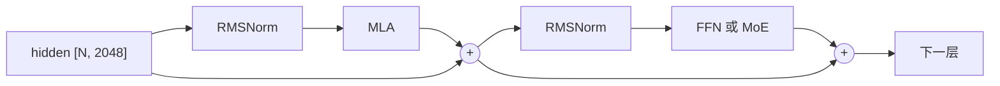

# DeepSeek-V2-Lite 模型结构详解

从 embedding 到 logits，把一次前向经过的每个部件捋一遍。这里只讲结构，
MLA 具体怎么算（prefill / decode 两条路径、KV cache 布局）见[项目 README](../README.md)。

参数数字可以自己跑出来：`python scripts/param_budget.py`

## 参数花在哪

| 部件 | 总参数 | 每个 token 激活 |
|---|---:|---:|
| embed_tokens | 0.21B | 0（只是查表） |
| **MLA × 27 层** | 0.37B | 0.37B |
| 第 0 层 dense FFN | 0.07B | 0.07B |
| **MoE × 26 层** | **14.85B** | 1.80B |
| lm_head | 0.21B | 0.21B |
| **合计** | **15.71B** | **2.45B** |

两个关键事实：

- **94% 的参数在 MoE 里**，但每个 token 只用上其中 12%。所谓 15.7B 总参数、2.4B 激活就是这么来的。
- **注意力只占 2.4% 的参数**，可它决定了 KV cache 大小和长文本的速度。参数少不等于不重要。

## 一、embed_tokens：查表

```
input_ids [7]  →  hidden [7, 2048]
```

一张 `102400 × 2048` 的表，每个 token id 取对应那一行。没有计算，就是内存读取。
出来的 `[7, 2048]` 就是接下来 27 层反复加工的东西。

V2-Lite 的 `tie_word_embeddings=False`，所以**输入的 embedding 表和最后的 lm_head 是两套独立权重**，各 0.21B。

## 二、核心概念：残差流

理解 Transformer 结构最重要的一句话：

> **`hidden` 是一条从头贯穿到尾的「主干道」，每一层不是替换它，而是往上面加东西。**

```
hidden = embedding
hidden = hidden + 注意力层算出来的增量
hidden = hidden + FFN 算出来的增量
...                                共 27 层，54 次累加
hidden → 最后归一化 → lm_head → logits
```

所以任何一层「坏掉」（输出全 0），模型也不会崩，只是少了一份贡献；梯度也能沿着这条主干道直通到底，
这是深层网络能训起来的关键。代码里这条主干道就是 `DecoderLayer.forward`（`llm_infer/model.py`）里的 `residual` 变量。

## 三、一层的骨架（27 层都一样）



这叫 **pre-norm**：归一化放在子层**前面**，主干道上不做归一化。
早期 Transformer 是 post-norm（归一化在残差相加之后），深层时训练不稳定，现在基本都改成 pre-norm。

代码里把「+ 残差」和「下一层的 RMSNorm」合并成一个算子 `fused_add_rms_norm`，
因为它们紧挨着，合起来能少读写一遍 2048 维数据。

## 四、RMSNorm

### 形状规则

```
输入 [..., D]  →  输出 [..., D]       形状完全不变
权重 [D]                              只有最后一维这么长
```

前面有多少维、每维多大都无所谓，**只有最后一维 D 参与归一化**：

| 输入 | 权重 | 输出 |
|---|---|---|
| `[7, 2048]` | `[2048]` | `[7, 2048]` |
| `[2, 7, 2048]` | `[2048]` | `[2, 7, 2048]` |
| `[5, 512]` | `[512]` | `[5, 512]` |

### 逐行独立

RMSNorm 是**逐行独立**的运算，把张量看成 `n` 行、每行 `D` 个数：

```
对每一行 x[0..D-1]：
    rms = sqrt( (x₀² + x₁² + … + x²_{D-1}) / D + ε )
    输出[j] = x[j] / rms × weight[j]
```

每行自己算自己的，行与行之间没有任何交互（把第 0 行乘 100，其他行的输出一个字节都不变）。
归一化后每行的均方根变成 1，再乘可学习的 `weight` 做逐维缩放。

这也是为什么前面的维度可以任意：`[2, 7, 2048]` 和 `[14, 2048]` 对 RMSNorm 是同一件事。
C++ 内核就是这么处理的（`csrc/cpu/norm_act.cpp`）：

```cpp
const int64_t d = input.size(-1);        // 最后一维
const int64_t n = input.numel() / d;     // 前面所有维乘起来，拉平成 n 行
```

本项目把 token 拉平成一维，所以传进去的都是二维 `[N, D]`（N = 这批的 token 总数）；
HuggingFace 那种写法是三维 `[batch, seq, D]`，行为完全一样。

### 和 LayerNorm 的区别

| | LayerNorm | RMSNorm |
|---|---|---|
| 输入输出形状 | `[..., D]` → `[..., D]` | 一样 |
| 参数 | `weight [D]` + `bias [D]` | 只有 `weight [D]`，**没有 bias** |
| 计算 | 先减均值，再除标准差 | **不减均值**，直接除均方根 |

少了减均值这一步就少一遍求和，效果实测差不多，所以现在的大模型基本都用 RMSNorm。
它的作用是把向量的「长度」拉到固定尺度、只保留方向信息，让后面的矩阵乘输入稳定。

### 模型里出现在哪

V2-Lite 一次前向要做 **82 次** RMSNorm：

| 位置 | 维度 | 个数 |
|---|---:|---:|
| `input_layernorm`（注意力前） | 2048 | 27 |
| `post_attention_layernorm`（FFN/MoE 前） | 2048 | 27 |
| **`kv_a_layernorm`（MLA 内部，作用在压缩后的 latent 上）** | **512** | 27 |
| `model.norm`（lm_head 前） | 2048 | 1 |
| 合计 | | **82**，参数 0.126M |

注意 `kv_a_layernorm` 的维度是 **512 不是 2048**，它归一化的是压缩后的 latent，很多人第一次读代码会忽略。
完整版 V2 还多一个 `q_a_layernorm`（1536 维），V2-Lite 没有。

参数加起来只有 0.126M（占全模型的 0.0008%），但少了它训练会炸。

### 精度：半精度也在 float32 里算

无论权重是 bf16 还是 fp16，求平方和这一步都会先升到 float32，写回时再转成原 dtype。
`x²` 求和很容易在半精度下溢出或丢精度，这跟官方实现一致：

```python
xf = x.float()
xf = xf * torch.rsqrt(xf.pow(2).mean(-1, keepdim=True) + eps)
return weight * xf.to(dtype)     # llm_infer/ref_ops.py
```

CUDA 内核也是同样策略：`c10::Half` / `c10::BFloat16` 读出来立刻转 float，算完再转回去。

### 为什么要和残差相加融合

RMSNorm 是**访存密集型**的：读 `N×D` 个数、写 `N×D` 个数，中间只有几次乘加。
算力再强也没用，瓶颈在内存/显存带宽。

而在 pre-norm 结构里，「残差相加」后面紧跟着就是下一次 RMSNorm，所以合成一个算子 `fused_add_rms_norm`：

```
不融合：读 x、读 res → 写 res      再读 res → 写 x      （4 趟 N×D 访存）
融合后：读 x、读 res → 写 res、写 x                     （3 趟，且 res 还在缓存里）
```

`scripts/bench.py` 实测这个融合算子比 PyTorch 版快约 1.25 倍，快的部分基本全来自省下的访存。

## 五、MLA：注意力

16 个头，每个头的 Q/K 是 192 维（128 不带位置 + 64 带位置），V 是 128 维。

| 权重 | 形状 | 作用 |
|---|---|---|
| `q_proj` | 2048 → 3072 | 一次出 16 个头的 Q（16 × 192） |
| `kv_a_proj_with_mqa` | 2048 → 576 | **压缩**：512 维 latent + 64 维 k_pe |
| `kv_a_layernorm` | 512 | 给 latent 做归一化 |
| `kv_b_proj` | 512 → 4096 | **解压**：latent → 16 个头的 K(128) 和 V(128) |
| `o_proj` | 2048 → 2048 | 16 个头的输出拼起来投回主干道 |

结构上的三个要点：

1. **K 和 V 不直接算出来，而是先压成 512 维的 latent**，要用的时候再用 `kv_b_proj` 展开成 16 个头。
   缓存的是这个 512 维 latent（加 64 维 k_pe），而不是 16 个头的完整 K/V。这是 MLA 省显存的全部秘密。
2. **位置信息单独走一条 64 维通道。** 为什么不把 RoPE 直接加在压缩后的 latent 上？
   因为 RoPE 是跟位置相关的旋转，加在 latent 上之后，`kv_b_proj` 这个解压矩阵就没法和 Q 侧矩阵合并
   （见 README 里 decode 用到的那两条恒等式）。所以位置信息被剥出来单独存 64 维，16 个头共享同一份。
3. **完整版 V2 连 Q 也压缩**（`q_lora_rank=1536`），V2-Lite 省掉了这步，`q_proj` 直接出结果。
   代码里两种都支持。

## 六、第 0 层：普通 FFN（SwiGLU）

```
2048 → gate_proj → 10944 ┐
                          ├→ silu(gate) × up → down_proj → 2048
2048 → up_proj   → 10944 ┘
```

三个矩阵，中间维度 10944（约 5.3 倍 hidden）。SwiGLU 比传统的 `relu(xW1)W2` 多一个 `up` 分支，
`silu(gate)` 起门控作用，决定 `up` 的每个维度放行多少。

**为什么第 0 层不用 MoE？** 配置里 `first_k_dense_replace=1`。训练刚开始时 embedding 还没学出结构，
路由器在最底层分不出该派给谁，容易全挤到少数几个专家上。让第一层用固定 FFN、路由从第 1 层再开始，训练更稳。

## 七、第 1–26 层：DeepSeekMoE

```
x [7, 2048]
 ├→ gate (2048→64) → softmax → 选出分最高的 6 个专家 + 各自权重
 │    └→ 6 个专家各自 SwiGLU (2048→1408→2048)，输出按权重加权求和
 └→ 共享专家 SwiGLU (2048→2816→2048)         ← 每个 token 都过
        两路相加 → 输出 [7, 2048]
```

DeepSeekMoE 相比传统 MoE 的两个设计：

1. **专家切得细**：单个专家中间层只有 1408 维，是 dense FFN（10944）的 1/8。
   专家小、数量多（64 个），选 6 个的组合数非常大，不同 token 能走出差异很大的组合。
   传统 MoE 常是 8 个大专家选 2 个，组合远没这么灵活。
2. **有共享专家**：2 个专家（代码里合并成一个 2816 维 SwiGLU）对所有 token 都生效。
   把「谁都用得上的通用知识」固定放这儿，路由专家就能专心学各自擅长的部分，不用每个都重复学一遍通用能力。

**路由是 token 级、层级独立的**：同一个 token 在第 1 层和第 2 层可能被派到完全不同的专家，
同一句话里的不同 token 也各走各的，所以生成时每层都要重新算路由。

## 八、收尾

```
hidden [7, 2048] → RMSNorm → lm_head (2048 → 102400) → logits [7, 102400]
```

`lm_head` 是全模型**单次计算量最大的矩阵乘**（0.21B 参数，比 27 层注意力加起来的一半还多）。
所以 decode 时代码只对最后一个位置算 logits，不会对所有位置都算。

## 形状变化总表

以 7 个 token 的 prompt 为例：

| 阶段 | 形状 | 说明 |
|---|---|---|
| input_ids | `[7]` | token id |
| embedding 后 | `[7, 2048]` | 进入残差流 |
| 每层内部 Q | `[7, 16, 192]` | 16 个头 |
| 每层缓存 | `[7, 576]` | latent 512 + k_pe 64 |
| 注意力输出 | `[7, 16, 128]` → `[7, 2048]` | 拼接后投影回来 |
| 27 层之后 | `[7, 2048]` | 形状始终不变 |
| logits | `[7, 102400]` | 每个位置对下一个词的打分 |

**整个模型里 `[N, 2048]` 这个形状从头到尾没变过**，中间各种展开成 16 个头、压缩成 512 维、
扩张到 10944 维，最后都会投影回 2048。记住这点，看代码时就不容易迷路。

## 对应的代码

| 内容 | 位置 |
|---|---|
| 整个模型 | `llm_infer/model.py` — `DeepseekV2ForCausalLM` |
| 一层 | `llm_infer/model.py` — `DecoderLayer` |
| MLA | `llm_infer/model.py` — `MLAttention` |
| MoE | `llm_infer/model.py` — `MoE` / `Experts` / `Router` |
| 配置项 | `llm_infer/config.py` — `ModelConfig` |
